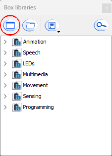
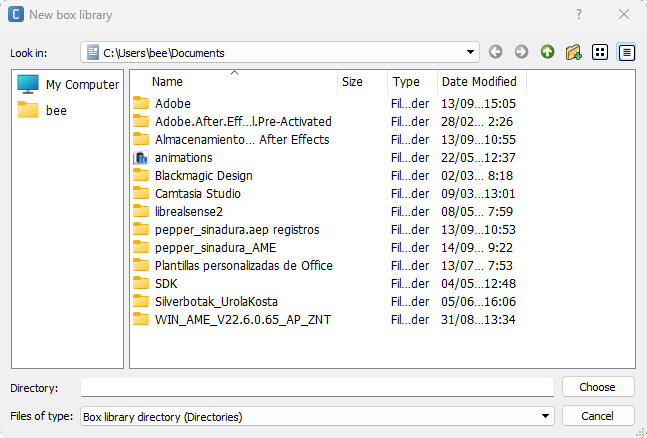

# Importar el paquete Animations

Desde hace unos años los robots *Nao* y *Pepper* han visto reducido el catálogo de animaciones que vienen por defecto. Para importar la librería de cubos llamada *animations* de este repositorio, haremos lo siguiente: 

1. En el panel de las librerías (margen inferior izquierdo) clickaremos en *Open box library* (1. Imagen, marcado en rojo). 

||
|:----------------------------------:|
| 1. Imagen: Box libraries |

2. Navegaremos hasta la ubicación donde hayamos descargado el paquete animations (segunda imagen, paquete *animations*). 

||
|:----------------------------------:|
| 2. Imagen: Importar librería |

3. Buscaremos el archivo *animations.cbl* y por último haremos click en importar. 

Para más información sobre como crear e importar paquetes, acudir al siguiente [enlace](http://doc.aldebaran.com/2-5/software/choregraphe/panels/box_libraries_panel.html#box-library-formats)